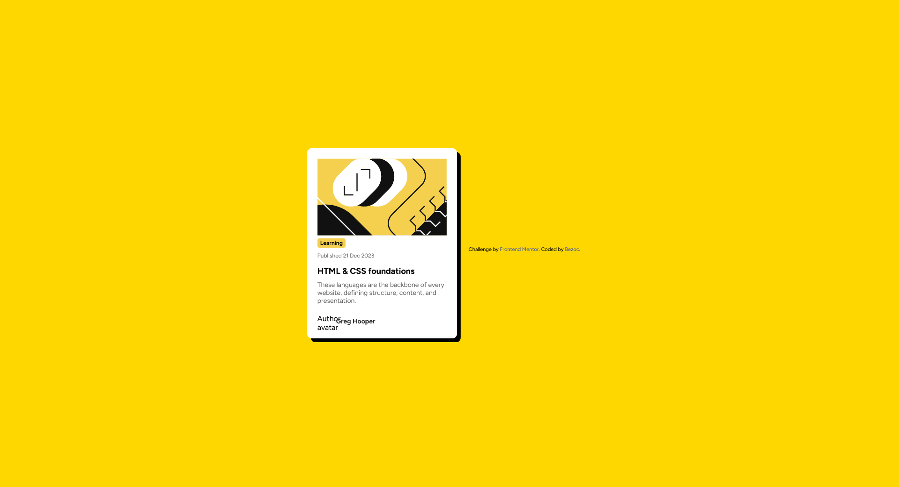

# FrontendMentor-BlogPreviewCard

# FrontendMentor-BlogPreviewCard

## Table of contents

- [Overview](#overview)
  - [Screenshot](#screenshot)
  - [Links](#links)
- [My process](#my-process)
  - [Built with](#built-with)
  - [What I learned](#what-i-learned)
- [Author](#author)

### Screenshot

### Links

- Solution: [<https://github.com/bezoc/FrontendMentor-BlogPreviewCard)>]
- Live Site: [https://bezoc.github.io/FrontendMentor-BlogPreviewCard/]
## My process

### Built with

- Semantic HTML5 markup
- CSS custom properties
- Flexbox
- Mobile-first workflow

### What I learned

In this project, I practiced:

- Structuring HTML with semantic elements
- Using Flexbox to manage layouts
- Styling a card component
- Implementing responsive design principles

## Author

- Frontend Mentor - [bezoc](https://www.frontendmentor.io/profile/bezoc)

